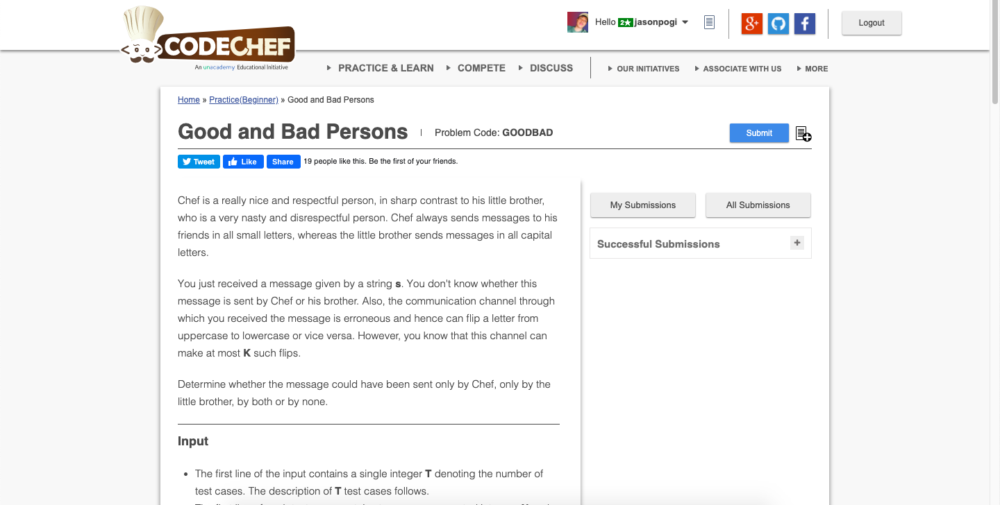

# Codechef-Good-and-Bad-Persons
### Problem

### Program Simulation
<pre>
  Sample Input:
  5 1
  frauD
  
  c = 0
  b = 0
  
  * Iterate through the string and count the number of lowercase or uppercase *
  
  c = 4
  b = 1
  
  if(4 <= 1 && 1 <= 1) // false
  else if(1 <= k) // true
    print "chef"
  
  Final Output:
  chef
  

  Sample Input: 
  5 1
  FRAUD
  
  c = 0
  b = 5
  
  * Iterate through the string and count the number of lowercase or uppercase *
  
  if(0 <= 1 && 5 <= 1) //false
  else if(5 <= 1) // false
  else if(0 <= 1) // true
    print "brother"
  
  Final Output:
  brother
  

  Sample Input:
  4 4 
  Life
  
  c = 3
  b = 1
  
  * Iterate through the string and count the number of lowercase or uppercase *
  
  if(3 <= 4 && 1 <= 4) // true
    print "both"
  
  Final Output:
  both
  

  10 4
  sTRAWBerry
  
  c = 5 
  b = 5
  
  * Iterate through the string and count the number of lowercase or uppercase *
  
  if(5 <= 4 && 5 <= 4) // false
  else if(5 <= 4) // false
  else if(5 <= 4) // false
  else 
    print "none"
  
  Final Output:
  none
</pre>
